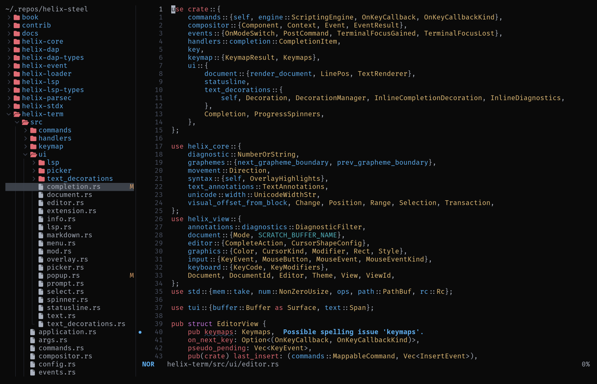

# file-tree.hx

file-tree.hx is a file tree explorer for [Helix](https://github.com/helix-editor/helix/): a persistent sidebar panel showing the workspace tree, with git status indicators and indent guides.

It's derived from [forest.hx](https://github.com/Ra77a3l3-jar/forest.hx).



---

## Installation

**1. Install the plugin-enabled fork of Helix** by following the instructions [here](https://github.com/mattwparas/helix/blob/steel-event-system/STEEL.md).

**2. Install file-tree.hx via forge:**

```sh
forge pkg install --git https://github.com/fabian1409/file-tree.hx.git
```

**3. Load the plugin** by adding this to your `init.scm`:

```scheme
(require "file-tree/file-tree.scm")
```

Bind `:file-tree-open` to a key, e.g. in `init.scm`:

```scheme
(keymap (global)
        (normal (space (t ":file-tree-open"))))
```

Which entries are hidden by default (dotfiles, `.gitignore`d files, etc.) follows Helix's own `file-picker` configuration (`hidden`, `git-ignore`, `git-exclude`, `git-global`) - no separate config needed.

---

## Usage

| Key | Action |
|-----|--------|
| `↑` / `↓` / `j` / `k` | Navigate |
| `Enter` | Open the selected file, or toggle the selected directory |
| `Tab` | Toggle the selected directory (outside search) |
| `n` | Create a file or directory (end name with `/` for a directory) |
| `r` | Rename the selected entry |
| `d` | Delete the selected entry |
| `R` | Refresh the tree |
| `.` | Toggle dotfiles (`.env`, `.git`, etc.) |
| `i` | Toggle git-ignored entries |
| `+` / `-` | Widen / narrow the panel |
| `Esc` | Switch focus to the editor, panel stays open |
| `q` | Close the panel |

### Remapping keys

Override any subset of the default keybindings from `init.scm`:

```scheme
(require "file-tree/file-tree.scm")

(file-tree-set-keybinds! (hash 'rename "R" 'refresh "r"))
```